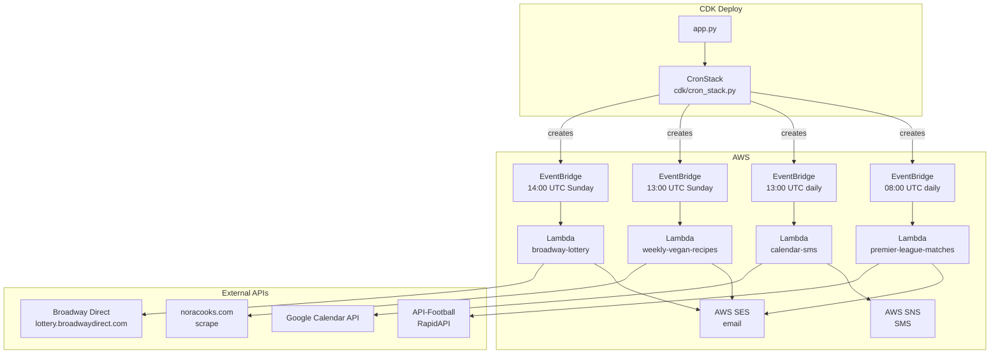

# UML — cron

_Last updated: 2026-05-13 — added broadway-lottery job_

## Overview

AWS CDK (Python) app that deploys scheduled cron jobs as Lambda functions
triggered by EventBridge rules. Each job lives in `jobs/` as a self-contained
folder with a `handler.py` and optional vendored dependencies.

## Module map

- `app.py` — CDK entry point; instantiates `CronStack`
- `cdk/cron_stack.py` — `CronStack`: defines all Lambda functions and EventBridge rules via `create_scheduled_lambda()` helper
- `jobs/premier_league/` — fetches daily Premier League fixtures from API-Football, emails summary via SES (08:00 UTC)
- `jobs/calendar_sms/` — fetches today's Google Calendar events, sends SMS via SNS (13:00 UTC)
- `jobs/weekly_recipes/` — scrapes Nora Cooks, picks 5 vegan recipes seeded by ISO week, emails via SES (13:00 UTC Sunday)
- `jobs/example_job/` — minimal template for new jobs
- `jobs/broadway-lottery/` — authenticates with Broadway Direct, picks 2 random active lotteries, enters each for 2 tickets, emails confirmation via SES (14:00 UTC Sunday)
- `jobs/shared/` — shared utilities: `fetch_url`, `call_llm` (OpenAI-compatible)
- `skills/` — project-local pi skills (`backend-developer`)

## Component diagram

## Key data flows

- **Scheduled job run:** EventBridge fires on cron → invokes Lambda → handler fetches external data → delivers via SES (email) or SNS (SMS) → returns `{status, ...}` dict
- **Deploy:** `cdk deploy` → CDK synthesizes CloudFormation template in `cdk.out/` → provisions Lambda + EventBridge rule + IAM role per job
- **New job:** add folder under `jobs/`, implement `handler.main(event, context)`, register via `create_scheduled_lambda()` in `CronStack`

## Last activity

- `2026-05-13` — added `broadway-lottery` job: Sunday 14:00 UTC, enters 2 random Broadway Direct lotteries, SES email confirmation. Files: `jobs/broadway-lottery/handler.py`, `cdk/cron_stack.py`, `README.md`
- `2026-05-13` — initial UML generated by pi. Files surveyed: `app.py`, `cdk/cron_stack.py`, `jobs/*/handler.py`, `jobs/shared/utils.py`
